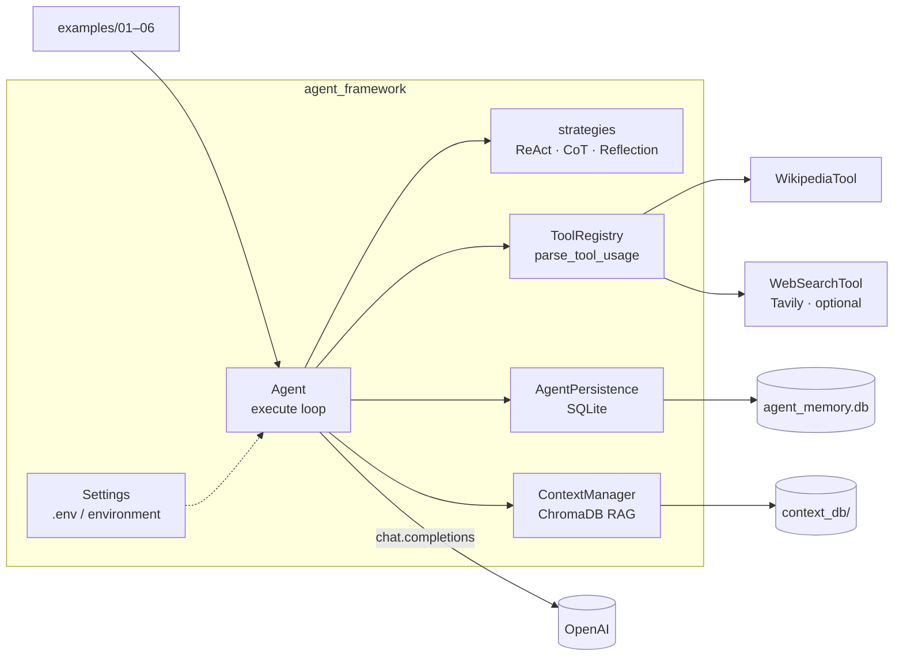
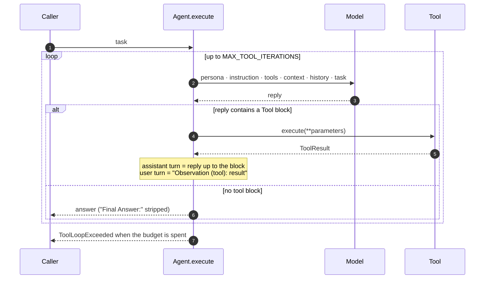

# Agent Framework

[](https://github.com/daniellopez882/Agent-Framework/actions/workflows/ci.yml)


A small Python library for building an LLM agent out of five parts: a
**persona**, **conversation memory** (SQLite), a **prompting strategy**
(ReAct, chain-of-thought, reflection), optional **RAG context** (PDF →
ChromaDB), and **tools** the model can call in a real reason/act loop.

> **Provenance.** The previous README described this repository as
> "rebranded and maintained by" the account owner without naming a source, and
> its six-step layout resembles a tutorial series. This README does not claim
> the original design. It documents what is here now, and what was changed
> — every item in the table below was reproduced on the original code before
> it was fixed.

## At a glance

| | |
|---|---|
| **Is** | One importable package, `agent_framework`, plus six runnable examples — one per capability level |
| **Was** | Six directories, each a copy of the last with one more feature; `context.py` existed twice byte-for-byte, `strategy.py` three times; nothing was importable from a test |
| **Model** | OpenAI chat completions; model, timeout and iteration budget are settings; the client is injectable |
| **Tests** | 66, none of which call a model or the network — the model is a stub, Wikipedia and Tavily are stubs, ChromaDB runs in a temp dir with a stub embedding function |
| **CI** | ruff · `ruff format --check` · mypy · pytest on 3.11/3.12 · import-has-no-side-effects check · bandit · pip-audit · gitleaks · container: non-root, reports config, refuses `--strict` without a key, runs the suite inside the image |

## Architecture



### One task, with tools



The old code did step 2 once, ran the tool, pasted its output into the
reply text and returned that. The model never saw an observation
([ADR 0002](docs/adr/0002-a-real-tool-loop.md)).

## Getting started

```bash
python -m venv .venv && . .venv/bin/activate     # Windows: .venv\Scripts\activate
pip install -r requirements.txt                  # or: pip install -e ".[dev]"
cp .env.example .env                             # set OPENAI_API_KEY; TAVILY_API_KEY optional
python -m agent_framework check                  # prints the effective configuration
python examples/06_tools.py
```

```python
from agent_framework import Agent
from agent_framework.wikipedia_tool import WikipediaTool

agent = Agent("helper")
agent.persona = "You explain things clearly."
agent.strategy = "ReactStrategy"
agent.tools = [WikipediaTool()]
print(agent.execute("What is the capital of Telangana, and what is it known for?"))
```

Failures raise `AgentError` (`ConfigurationError` when a key is missing,
`ToolLoopExceeded` when the model will not stop calling tools).

### Examples

| Script | Shows |
|---|---|
| `examples/01_persona.py` | A persona answering two tasks |
| `examples/02_memory.py` | Three tasks where the third depends on history; `clear_history()` |
| `examples/03_reasoning.py` | The same task under each strategy |
| `examples/04_persistence.py` | `pause()` an agent, resume it in a new instance with its pending task |
| `examples/05_context.py` | Index a PDF into ChromaDB and answer from it |
| `examples/06_tools.py` | A two-hop task with Wikipedia and (if configured) web search |

### Container

```bash
docker build -t agent-framework .
docker run --rm agent-framework                                   # `check`
docker run --rm --env-file .env -v af-data:/data agent-framework python examples/06_tools.py
```

Runs as uid 10001; state goes to `/data`.

## Configuration

| Variable | Default | Notes |
|---|---|---|
| `OPENAI_API_KEY` | — | Required to execute |
| `OPENAI_MODEL` | `gpt-4o-mini` | Any chat-completions model |
| `OPENAI_TIMEOUT_SECONDS` | `60` | |
| `TAVILY_API_KEY` · `TAVILY_MAX_RESULTS` | — · `3` | Key present ⇒ `WebSearchTool.available` |
| `MAX_TOOL_ITERATIONS` | `5` (1–25) | Model calls per task, at most |
| `AGENT_DB_PATH` | `agent_memory.db` | SQLite; history and pending tasks |
| `CONTEXT_PERSIST_DIR` | `context_db` | ChromaDB directory |

## What changed, and why

| # | Defect | Effect |
|--:|---|---|
| 1 | Six step directories, each a copy of the last | 3,800 lines for ~700 of code; nothing importable; one bug fixed in six places or none ([ADR 0001](docs/adr/0001-one-package-not-six-copies.md)) |
| 2 | `langchain` unpinned; `from langchain.text_splitter import …` | On a fresh install langchain 1.x resolves and the module is gone: `context.py`, and so `agent.py`, **could not be imported** |
| 3 | `execute()` called the model once and pasted tool output into its reply | A two-hop task ended after the first lookup; "ReAct" was a prompt, not a loop ([ADR 0002](docs/adr/0002-a-real-tool-loop.md)) |
| 4 | The tool block was cut at the end of the `Parameters:` line | `- query: …` lines left dangling in the answer |
| 5 | Parameters were taken from every line containing `:` and `-` | `Thought: first - then second` became a parameter named `Thought` |
| 6 | `Tool.parameters` typed `Dict[str, str]`; both tools returned nested dicts | The prompt showed the model `{'type': 'string', 'description': …}` |
| 7 | `WebSearchTool()` raised without `TAVILY_API_KEY` | `flow.py` could not start, even for the Wikipedia-only path |
| 8 | `load_agent_state` called `agent.initialize_context`, which did not exist | An agent saved with a context could **never be restored**; the error was swallowed by a bare `except` |
| 9 | Every property setter wrote a state row; "latest" was `ORDER BY timestamp` at one-second resolution | Several rows per second; the wrong one could load |
| 10 | Model name hardcoded; a new `OpenAI()` per call; no injection point | Untestable without spending money |
| 11 | Errors returned as answer strings (`"An error occurred: …"`) | A caller could not tell a failure from a reply |
| 12 | Wikipedia disambiguation treated as failure; `"..."` appended to every summary; `format_wiki_result` read keys never produced | Wrong or dead behaviour in the one tool that always worked |
| 13 | No `.gitignore` | The first run would have committed `agent_memory.db` and `context_db/` |
| 14 | Chunk ids were a hash of chunk text + metadata | A document with two identical chunks (repeated PDF headers/footers) failed with `DuplicateIDError`, swallowed into `False`; re-indexing a document raised the same. Ids are positional now and indexing upserts — found by running the suite inside the container |

Also: `print` → `logging`; `langchain` (1.x, dozens of packages) replaced by `langchain-text-splitters`, the only part in use; ChromaDB metadata built from lists and `None`, which ChromaDB rejects, is now flattened.

## Design notes

| Record | Decision |
|---|---|
| [ADR 0001](docs/adr/0001-one-package-not-six-copies.md) | One package; the steps become examples |
| [ADR 0002](docs/adr/0002-a-real-tool-loop.md) | A bounded reason/act loop; a parser that knows where the block ends |
| [Threat model](docs/threat-model.md) | Prompt injection through tool output, spend, state on disk, model-chosen parameters, supply chain |

## Layout

```
agent_framework/
  agent.py           Agent: configuration properties, the execute loop, persistence calls
  tools.py           Tool, ToolResult, ToolRegistry, ToolCall, parse_tool_usage
  strategy.py        ReAct / chain-of-thought / reflection prompts; extract_final_answer
  persistence.py     AgentPersistence (SQLite), context restore through a factory
  context.py         ContextManager (PDF → chunks → ChromaDB), DocumentMetadata
  wikipedia_tool.py  websearch_tool.py
  config.py          Settings;  errors.py  exceptions;  __main__.py  `check`
examples/            01_persona … 06_tools
tests/               66 tests
docs/                ADRs, threat model
```

## Limits

- The loop stops on the first reply without a tool block; a model that answers
  and calls a tool in the same reply gets the tool, not the answer.
- History is plaintext SQLite; see the threat model.
- Nothing here has been run against a live model as part of CI; the examples
  are the manual check.

## Licence

MIT — see [LICENSE](LICENSE).
